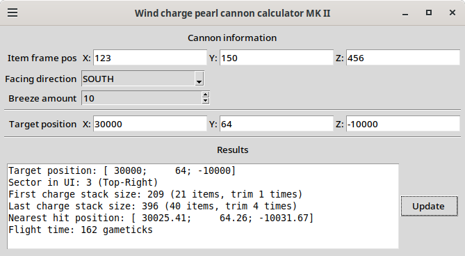

# Calculator for wind charge pearl cannon

## Overview

This calculator was written in Python to aid with aiming of cannon. It presents graphical window with input fields, and serves to convert coordinates of cannon and target into a cannon setting. Core math is based on formulas from Minecraft Wiki with further improvements.

Calculator was tested on targets up to 100k blocks away. Further testing was limited by concerns for PC de to loading chunks.

Note for Paper servers - during testing the observed distance was 1-1.5% shorter than predicted for unknown reasons. 

Sources of technical info:
- https://minecraft.wiki/w/Entity#Motion
- https://minecraft.wiki/w/Tutorial:360_degree_ender_pearl_cannon
- [Xcom6000 Pearl Cannons Playlist on YouTube](https://www.youtube.com/playlist?list=PLNmLmL7zi0m2Ivy9v5KVlNRs3gnbpO_jW)

## Installation

Compiled executables for Linux and Windows can be found in Releases.

To run Python project directly, first activate Python 3.12+ virtual environment in "Calculator" folder (find some other tutorial), install dependencies with "pip install -r requirements.txt", and run the calculator with "python calcWindow.py". 

To build project into an executable, use Pyinstaller. From virtual environment of working project, run "pip install pyinstaller", then run "pyinstaller --onefile calcWindow.py".

## How to use

1) Input cannon position into "Cannon origin settings" part of GUI. Origin is coded to be the block behind item frame. User must look at it with F3 and note its world coordinates as well as player's facing direction.
2) Set breeze amount to amount of breezes placed into generator. This serves only to estimate item count for hopper clock
3) Input target position in world coordinates. It is recommended to add 1-2 blocks to Y coordinate, because ender pearl will trigger on previous frame position during collision, resulting in slight undershoot.
4) Press "Update" button. This will write cannon settings into text field next to button. 

Resulting cannon settings contain sector for item frame selector, stack sizes for first and second wind charge stacks, closest real pearl position, and time of flight in gameticks. Also an estimate of items to be loaded into hopper clock is provided.

Error between target position and closest real pearl position is typically < 100 blocks.
