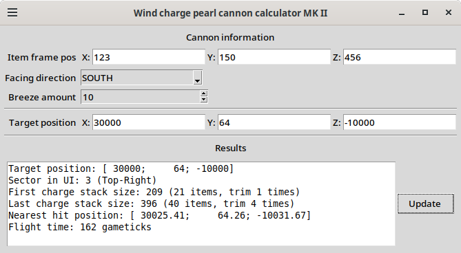

# Calculator for wind charge pearl cannon MK II

## Overview

This calculator was written in Python to aid with aiming of cannon. It presents graphical window with input fields, and serves to convert coordinates of cannon and target into a cannon setting. Core math is based on formulas from Minecraft Wiki with further improvements.

Calculator was tested on targets up to 100k blocks away. 

Note for Paper servers - during testing the observed distance appeared to be 1-1.5% shorter than predicted for unknown reasons. 

Sources of technical info:
- https://minecraft.wiki/w/Entity#Motion
- https://minecraft.wiki/w/Tutorial:360_degree_ender_pearl_cannon
- [Xcom6000 Pearl Cannons Playlist on YouTube](https://www.youtube.com/playlist?list=PLNmLmL7zi0m2Ivy9v5KVlNRs3gnbpO_jW)

## Installation

Compiled executables for Linux and Windows can be found in Releases on main page of this repository.

To run Python project directly, first activate Python 3.12+ virtual environment in "Calculator" folder (find some other tutorial), install dependencies with "pip install -r requirements.txt", and run the calculator with "python calcWindow.py". 

To build project into an executable, use Pyinstaller. From virtual environment of working project, run "pip install pyinstaller", then run "pyinstaller --onefile calcWindow.py".

## How to use

1) In-game, look at item frame in the center of UI in F3 screen. Find "Targeted block:" parameter and write it into "Item frame pos" field.
2) In same F3 screen, look for "Facing: " parameter. Select the same option in "Facing direction" field.
3) Obtain amount of breezes loaded into cannon. Set "Breeze amount" field.
4) Pick a target coordinate, input into "Target position" field. It is recommended to add 1 to Y height for slightly closer match.
5) Press "Update" button, use data to set up cannon.

Resulting cannon settings contain sector for item frame selector, stack sizes for first and second wind charge stacks, closest real pearl position, and time of flight in gameticks.

Error between desired target position and closest real pearl position is typically < 100 blocks.

Actual player position might be closer than predicted by 1 flight tick due to pearl collision logic.
