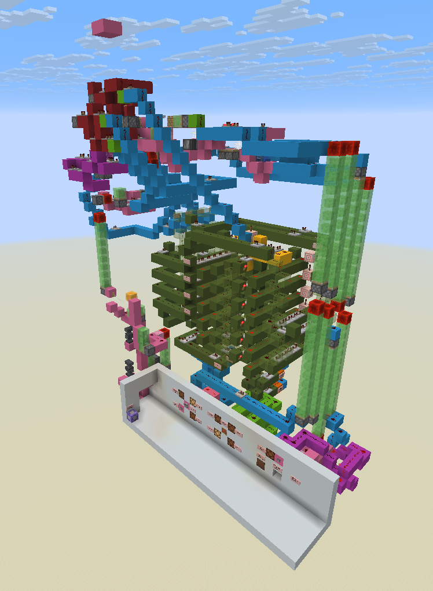
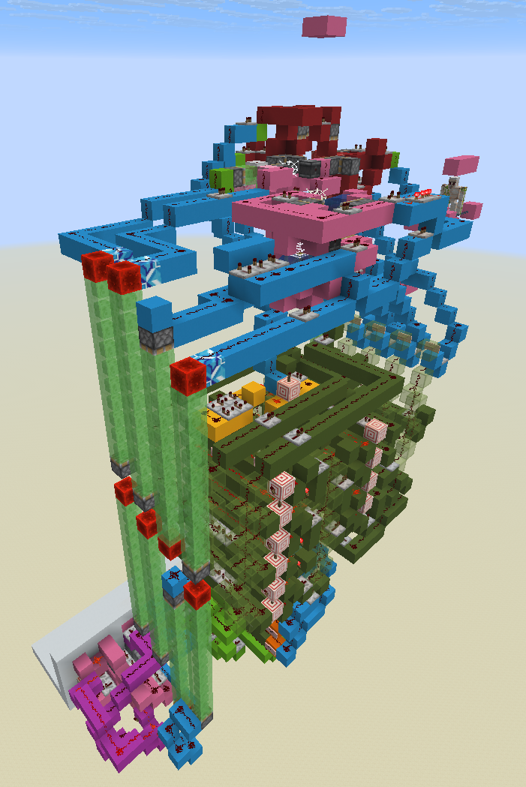
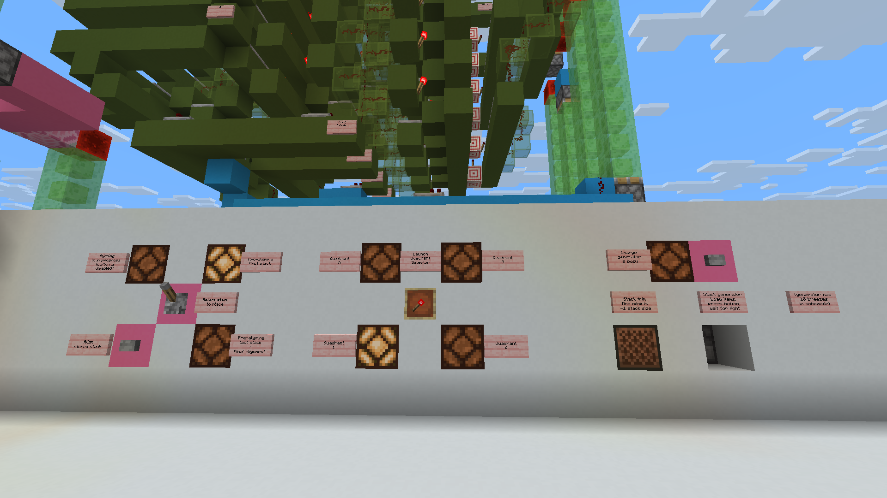
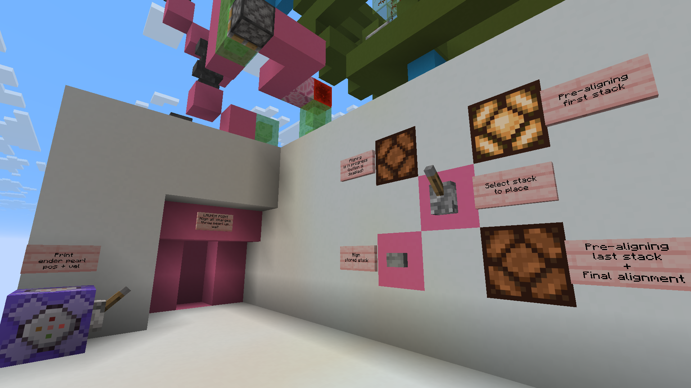

# Minecraft 360 degree wind charge pearl cannon MK II

  

 

## Overview

*( this is an improvement over original cannon - 'MK I', see https://github.com/mor-doc/Breeze360FTL )*

This project contains a Minecraft build of semi-automated, omnidirectional, breeze powered ender pearl cannon. 

Additionally, a ballistic calculator is written in Python. It converts data about cannon and target into a firing solution. See manual in Calculator folder. Pre-compiled binary can be downloaded from Releases section of repo.

Key features:
- Any firing angle
- Unlimited distance (limited by game resources)
- Semi-automated operation
- Works in Overworld only
- Dimensions: 34 x 43 x 17
- Tested in 1.21.8-1.21.11 Vanilla (Fabric) and on local 1.21.8 Paper server

Improvements of this design (MK II) over original (MK I):
- Fast precision wind charge generator. Manual trim is still required but was simplified a lot
- Simpler UI

Drawbacks over MK I: 
- Cannot work in Nether

## Building cannon

Folder Schematics contains Litematica build file of cannon. To access it in-game, move file into "schematics" folder of your Minecraft instance.

## Principle of operation

Cannon operation can be divided into 2 stages - charge preparation, and firing. 

Charge preparation results in 1-2 wind charge stacks occupying specific locations in aligner module. 4 locations are used, forming a skewed '+' sign within 2x2 area. Choice of stack locations determines firing direction, and their size ratio determines angle.

The firing is done by launching the ender pearl and charge stacks vertically up into 2x2 slab of blocks. A configuration was found that places pearl only slightly above charge explosion center, resulting in nearly horizontal velocity. More exact numbers can be found in "cannonConstants.py" file.

## Operating instruction

### Loading breezes into generator

1) Find the breeze holding chamber (look for flat pink concrete area)
2) Clear the breeze chamber of water and scaffolding, if present
3) Nametag and trap desired amount of breezes. Note the total amount somewhere
4) Place water at breezes feet
5) Place scaffolding into water block
6) Spawn and push an iron golem on top of iron trapdoor

### Firing sequence

1) Look at item frame at the center of cannon's control panel
2) Read item frame's position and player's facing direction from F3 screen
3) Open cannon's Python calculator. Input item frame position, player direction and amount of trapped breezes. 
4) Input target coordinate, press update to get firing solution. (for more info see calculator's README.md)
5) Select required quadrant by rotating item inside item frame
6) Generate first wind charge stack. Load required amount of items into dropper
7) Press button above the dropper, wait for lamp on the left of button to turn off, or for audible wind charge explosion. Wait ~2s more
8) Click on the noteblock once for each trim count. Use explosion sound as feedback or wait 1s between clicks
9) Flip the "Select stack to place" lever up
10) Push "Align stored stack" button
11) Generate last wind charge stack. Repeat steps 5-7 with new numbers
12) Wait for "Aligning is in progress" light to dim
13) Flip the "Select stack to place" lever down
14) Push "Align stored stack" button
15) Wait for "Aligning is in progress" light to dim
16) Enter the launch area, throw ender pearl vertically up
17) Wait for pearl to shoot and land

### Example shot

<iframe width="560" height="315" src="https://www.youtube-nocookie.com/embed/_UKjG0guAhI?si=4Q74jldHikSmo8j0" title="YouTube video player" frameborder="0" allow="accelerometer; autoplay; clipboard-write; encrypted-media; gyroscope; picture-in-picture; web-share" referrerpolicy="strict-origin-when-cross-origin" allowfullscreen></iframe>

## Contact info

If you have any questions, look for cannon's thread in [TNT Archive](https://discord.gg/vPyUBcdmZV) Discord server, in "finished-projects" channel.  
Alternatively, you can try contacting me at "max.etching316@passinbox.com".

## License

This work is dedicated to the public domain via CC0 (Creative Commons Zero).  
While not required, please provide credit (to "mor_doc") when using this work.
